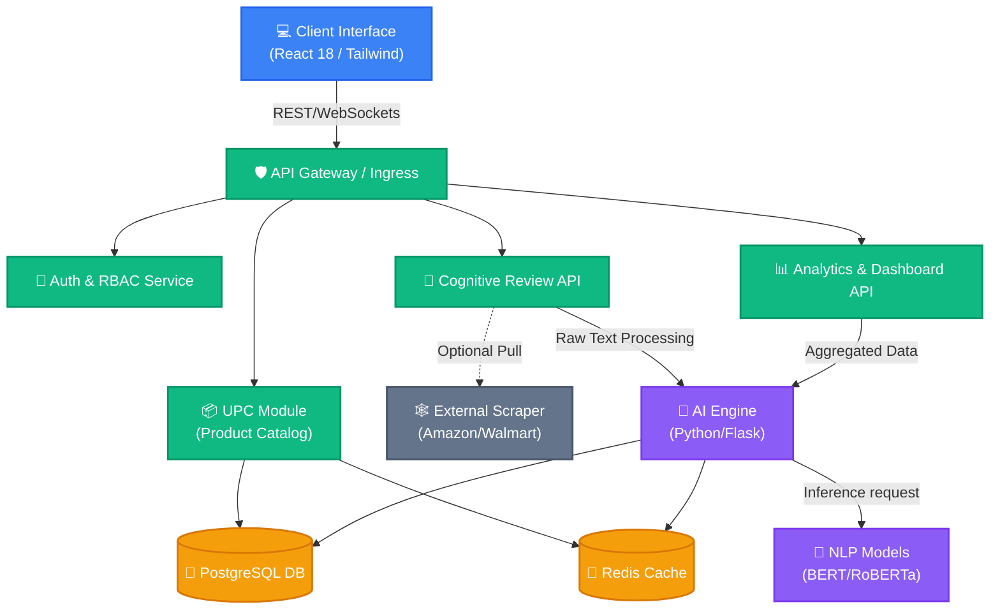

# SentixAI System Architecture & Component Tree

## System Architecture

The following diagram outlines the microservices architecture for the SentixAI platform, detailing the flow between the high-performance React frontend, the Python/Flask AI Engine, and the data layers.



## React Component Tree

Below is the proposed component structure for the React frontend, strictly adhering to an API-First, scalable methodology.

```text
src/
├── components/
│   ├── layout/
│   │   ├── Navigation.jsx           # Top app navigation (Role-based links)
│   │   ├── Sidebar.jsx              # Dashboard navigation (Analytics, Catalog, etc.)
│   │   └── Footer.jsx
│   ├── dashboard/                   # -> The "Insight Panel"
│   │   ├── InsightDashboard.jsx     # Main dashboard wrapper/layout
│   │   ├── SentimentHeatmap.jsx     # Real-time visual sentiment trends
│   │   ├── WordCloudWidget.jsx      # Keyword extraction visualization
│   │   ├── CompetitorBench.jsx      # Side-by-side comparison tables
│   │   └── ConfidenceMeter.jsx      # Bayesian probability score indicator
│   ├── catalog/                     # -> Unified Product Catalog (UPC)
│   │   ├── ProductGrid.jsx          # Multi-tenant search result display
│   │   ├── ProductCard.jsx          # Individual product summary (SKU, stats)
│   │   └── MediaGallery.jsx         # Lazy-loaded high-res & 3D preview component
│   ├── reviews/                     # -> The "Cognitive Review" Interface
│   │   ├── ReviewSubmission.jsx     # Text input with instant feedback streaming
│   │   ├── SentimentPreview.jsx     # Live feature-sentiment breakdown preview
│   │   └── ExternalImportForm.jsx   # Import reviews via URL (Amazon/Walmart)
│   └── shared/                      # -> Reusable UI Toolkit (Tailwind/Framer)
│       ├── StatCard.jsx             # Premium metric container
│       ├── StatusBadge.jsx          # Positive/Neutral/Negative tagging
│       └── SkeletonLoader.jsx       # Skeleton screens for async rendering
├── pages/
│   ├── index.jsx                    # Landing page / BI Overview
│   ├── catalog.jsx                  # Main product catalog search
│   ├── analytics/
│   │   └── [productId].jsx          # Deep-dive analytics for specific SKU
│   └── review-hub.jsx               # Entry point for cognitive reviews
├── store/
│   ├── apiSlice.js                  # React Query or Redux RTK Query client
│   └── authSlice.js                 # JWT Session & RBAC state management
└── utils/
    ├── nlp-helpers.js               # Local text parsing/formatting
    └── chart-config.js              # Theme/color config for data visualization
```

---

### Highlights & Implementation Notes:
- **Scalability:** The backend isolates the deep-learning inference (AI Engine) from basic CRUD operations (UPC Module) to prevent bottlenecks.
- **Data Visualization:** The `dashboard` components will rely on specialized charting libraries (e.g., Recharts or Chart.js) styled uniformly via Tailwind classes to match the "Amazon-Elite" aesthetic.
- **The Cognitive Reviewer:** Real-time web-sockets or Server-Sent Events (SSE) will be mapped to `ReviewSubmission.jsx` to power the "Instant Sentiment Preview" without waiting for a form submission.
